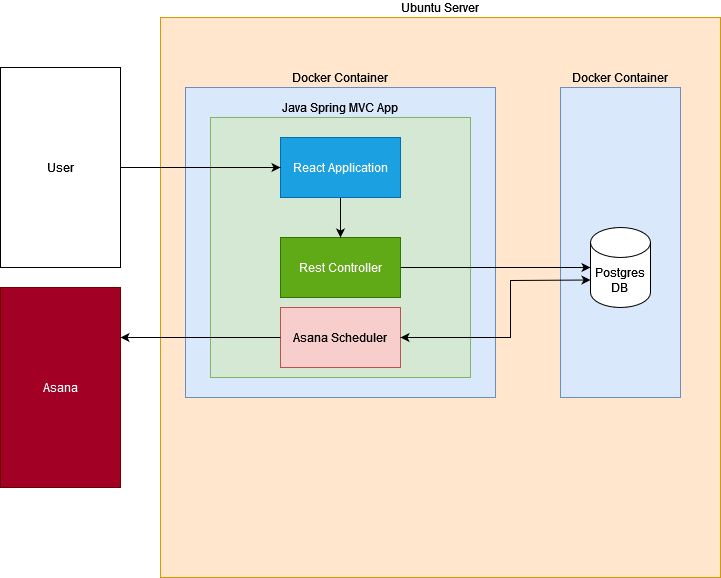

# DDG User Feedback

### Config

Create an .env file in this folder, with these values:

```
DATABASE_NAME="<Your DB Name>"
DATABASE_URL="jdbc:postgresql://localhost:5432/${DATABASE_NAME}"
DATABASE_USER="<Your User>"
DATABASE_PASSWORD="<Your Password>"
ASANA_WORKSPACE="<Your Workspace GID>"
ASANA_PROJECT="<Your Project GID>"
ASANA_PAT="<Your PAT>"
ASANA_USER_ID="<Your User GID>"
```

### Local Deploy

1. Ensure postgres is running
1. (First time only) create the local database: `createdb <Your DB Name>`
1. (First time only) run the initial migration: `psql -d <Your DB Name> -f db/create_tables.sql`
1. Export the .env file as env vars:

```
eval $(cat .env)
```

Deploy the backend and frontend in two different shells:

##### Rest Service (Backend)

1. `./mvnw install`
2. `./mvnw spring-boot:run`

##### Client (Frontend)

Running Node Version >= 16

1. `cd client`
2. `npm install`
3. `npm start`

Runs on `localhost:3000` by default.

#### How to deploy (locally) using Docker Compose

```
docker compose up -d
```

### Deploy to dev

Your code will automatically deploy to dev on merging to main. The dev server can be found at:

[http://20.151.139.80/](http://20.151.139.80/)

### Deploy to another server.

Request provisioning script from the owners of this repo. _The script is included in this repo but the secrets are redacted._ Once provided, execute it on the desired server:

```
ssh username@ip-address 'bash -s' < provision.sh
```

### Troubleshoot in Prod

For now, there is just one server. 😨 Your best best is to check the logs; uncaught exceptions will print a stack trace.

There is no need to alter the log level, the application will print everything by default.

Confirm docker container are healthy:

```
docker ps
```

View backend logs:

```
docker ps rest-service
```

Database access:

```
docker exec -u root -it ddg_app-db-1 /bin/bash
psql -U <Your User> -d <Your Database Name>
```

If the application seems unavailable / unresponsive, confirm that it's responding on port 8080--

```
curl localhost:8080/ping
```

If all else fails, restart the service by re-running the provisioning script, either from your local machine or manually trigger the github action.

```
ssh user@ip.add.ress 'bash -s' < ./provision.sh
```

### Architecture

#### Diagram

####



#### User Flow


#### Analysis Flow


#### Deployment Flow

1. Declare secrets.
1. Install Docker and Docker Compose
1. Clone application from Github.
1. Run docker compose.
   1. Build docker image for postgres server.
   1. Start postgres container.
      1. Run migration scripts.
      1. Perform healthcheck.
   1. Build docker image for Spring MVC application.
      1. Build UI react client using node.js
      1. Install npm dependencies.
      1. Bundle artifacts with react-scripts.
   1. Install java dependencies with Maven
   1. Copy react artifacts into Java static resource folder.
   1. Package java application into `jar` file.
   1. Start Spring MVC application on port 8080 by executing `jar`.
1. Forward traffic from port 80 to port 8080.

### Next Steps

1. Tests! Definitely unit tests, and ideally integration tests.
1. Distributed logging and dashboards; set up something like datadog.
1. Modernize the tooling; we are using older versions of java and node. Dependabot does not like package.json.
1. Deployment is pretty janky; we just ssh and execute a script. We should try to get some kind of deploy tooling set up-- Chef or Puppet, for example. We also need better secrets management... Github is currently the source of truth for secrets.
1. TLS Certificates, DNS, and a true proxy layer (nginx or apache) instead of iptables.
1. Consider making the frontend a true standalone app.
1. Set the database up on its own server. The application as-is cannot scale.
1. Better database migration management. Right now there is no way to ensure scripts run sequentially.
